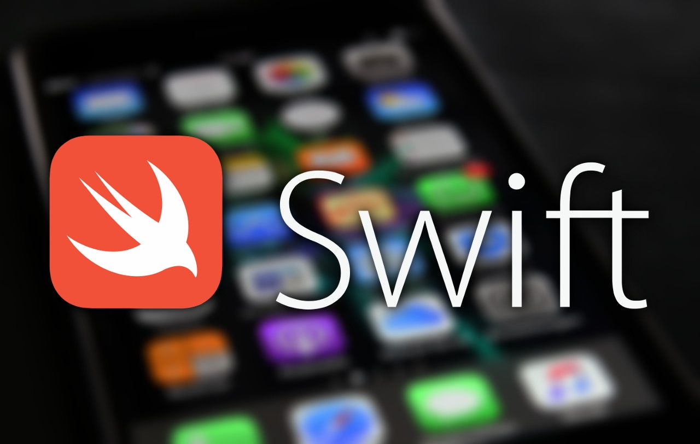

# Иванова Надежда

Имею 2 высших образования, прохожу курсы переподготовки для смены сферы рабочей деятельности. В настоящий момент прохожу курс ios - разработчик на онлайн - платформе Нетология.

1. Владение компьютером и офисным оборудованием 
1. Знание прикладного программного обеспечения
1. Знание основ языка Swift

